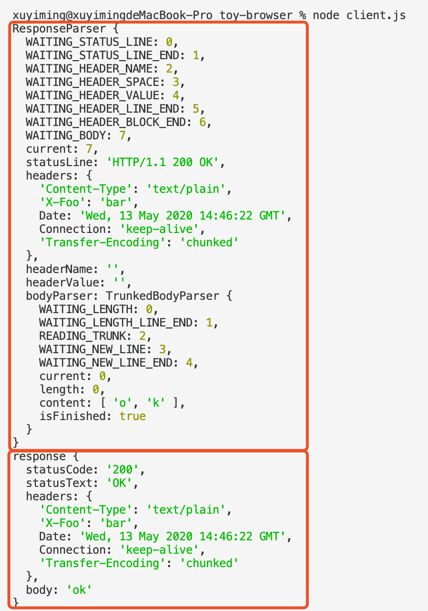

# 每周总结可以写在这里

## 结构化程序设计（JavaScript 语言中结构化程序设计的基础设施）

js 执行粒度

- JS Context => Realm
- 宏任务
- 微任务
- 函数调用（Execution Context）
- 语句/声明
- 表达式
- 直接量/变量/this

> Realm 中有多少个对象？
> - 重学前端

函数调用

- Execution Context Stack
- Execution Context
  - code evaluation state
  - Function
  - Script or Module
  - Generator
  - Realm
  - LexicalEnvironment
    - this
    - new.target
    - super
    - 变量
  - VariableEnvironment
    - 历史包袱，仅用于处理 var 声明

## 浏览器工作原理 | HTTP 协议 + 语法与词法分析

从地址栏到展示，浏览器做了哪些工作

ISO-OSI 七层网络模型

- http
  - request
  - response

- tcp
  - 流
  - 端口
  - require('net')

- ip
  - 包
  - ip 地址
  - libnet/libpcap

## 作业

- [toy-browser](./toy-browser/)

客户端最终 parser 与 response 截图

