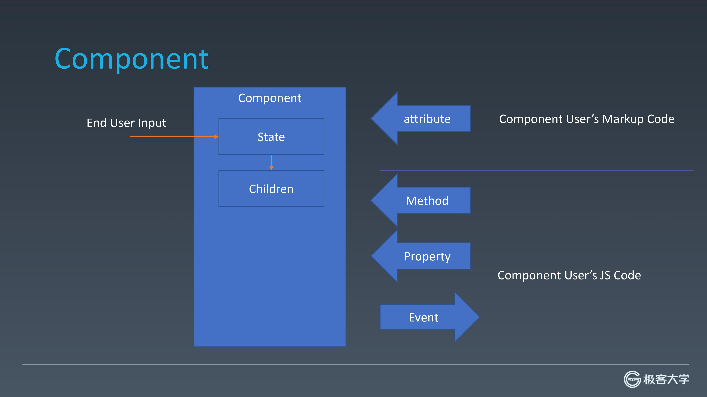
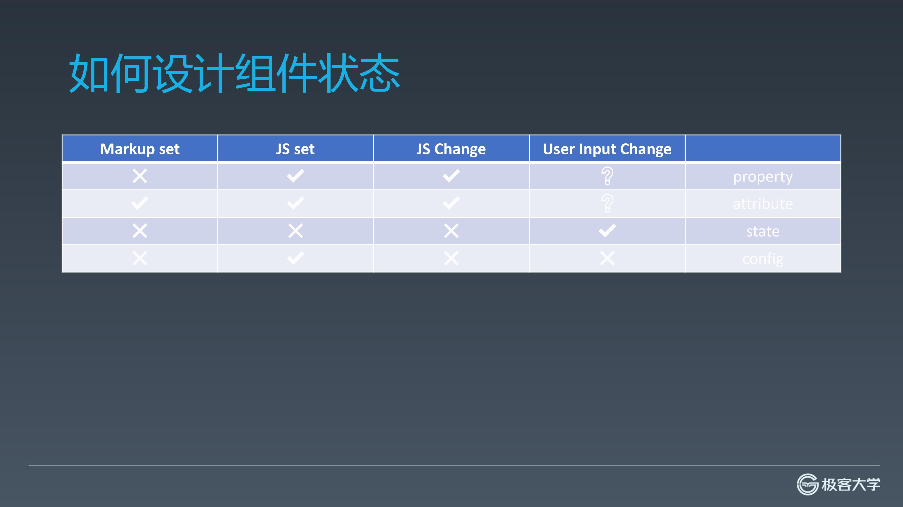
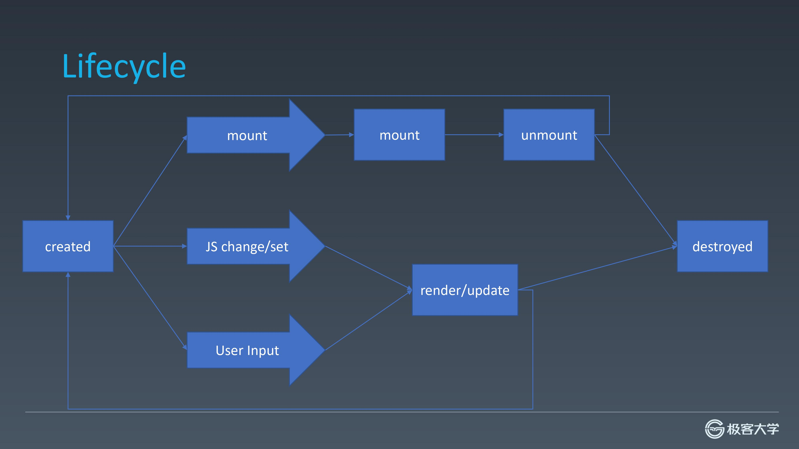

# 组件化基础

## 对象与组件

- 对象主要包含
  - properties 属性
  - methods 方法
  - inherit 继承

- 组件主要包含
  - properties
  - methods
  - inherit
  - attribute（properties 与 attribute 的区别）
  - config（构造时传入） & state（组件内部）
  - event 事件
  - lifecycle 生命周期
  - children 组件树

## 组件

- 组件内部包含 state 与 children，state 受终端用户输入影响
- attribute、method、property、event 是组件创建者与组件使用者间的沟通

## attribute

### attribute vs property

attribute 强调描述性
property 强调从属关系

### HTML 中的 attribute 与 property

- HTML 中只能设置 attribute，无法设置更改 property
- 在 JavaScript 中通过 getAttribute 与 setAttribute 更改 attribute，直接访问对象的属性来获取 property

#### 特例

- 名字不同

有些 attribute 与 property 完全一致，如 id。
也有些不一致如 class，在 attribute 中为 class，在 property 中为 className、classList

> class 不一致的原因是 js 早期不允许关键字做属性名

- 值结构不同

style，由于 style 较为复杂。在 attribute 中是以分号分隔的键值对，在 property 中则为对象

- href

href property 的取值是 resolve 后的结果（会形成完整的 URL 地址），而 getAttribute 则与 HTML 代码中一致

- value

input 元素的 value 更为特殊，其为单向绑定。若未设置 property，则 attribute 与 property 同步，而一旦设置 property，则 property 变化 attribute 不变，元素上实际显示为 property。此时的 attribute 需通过 setAttribute 更改，且对 attribute 的更改不会反应在元素上。

## 如何设计组件状态

- property 只能由 js 设置和改变，用户输入是否能改变则不一定
- attribute 可由标记、js 设置，并通过 js 改变，用户输入是否更改不一致
- state 只能由用户输入更改
- config 是传入组件构造函数的配置，一次性，只能由 js 设置

## 生命周期

## Children

- Content 型 Children
- Template 型 Children
  模板形式，如 vue 中的 v-for
